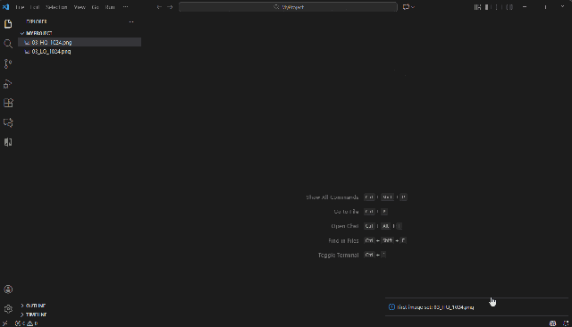

# Image Sync Diff

Synchronized image comparison with mosaic layout for VS Code.

## Features

- **Multi-Image Mosaic**: Compare 2-9 images simultaneously in an adaptive grid layout
- **Smart Grid Layout**: Automatically arranges images (2 images: 2 columns, 3-4 images: 2x2 grid, 5-9 images: 3x3 grid)
- **Reference Image Selection**: Designate any image as the reference with visual highlighting (blue border)
- **Quick Comparison**: Press and hold the overlay button to instantly show the reference image in all positions
- **Synchronized Zoom & Pan**: Zoom to any point in any image - all images stay perfectly aligned
- **Difference Highlighting**: Toggle pixel-level difference visualization between the reference and each comparison image
- **Keyboard Shortcuts**: Use `Ctrl+Alt+1-9` (or `Cmd+Alt+1-9` on Mac) to quickly change the reference image
- **State Preservation**: Your zoom, pan, and selections are preserved when switching tabs

## Usage

### Method 1: Compare Multiple Images (2-9)
1. Select 2-9 images in the VS Code File Explorer (hold `Ctrl` or `Cmd` to select multiple)
2. Right-click and choose **Compare Images with Sync Diff**
3. All images appear in a mosaic grid with the first image as the reference (highlighted with a blue border)
4. Use `Ctrl+Alt+1` through `Ctrl+Alt+9` (or `Cmd+Alt+1-9` on Mac) to change which image is the reference

### Method 2: Compare with First Image
1. Right-click on a single image in the File Explorer and select **Set as First Image**
2. Right-click on additional images and select **Compare with First Image**

### Method 3: Activity Bar
1. Open the **Image Sync Diff** view in the Activity Bar
2. Manage the "First Image" selection from here

## Controls

- **Mouse Wheel**: Zoom in/out at cursor position (synchronized across all images)
- **Mouse Drag**: Pan images (synchronized across all images)
- **Blue Overlay Button**: Press and hold to temporarily show the reference image in all positions
- **Ctrl+Alt+1-9** (or **Cmd+Alt+1-9** on Mac): Select which image to use as the reference
- **Differences Checkbox**: Toggle pixel difference visualization (reference vs each comparison image)
- **Reference Dropdown**: Select which image to use as the reference (shows actual filenames)
